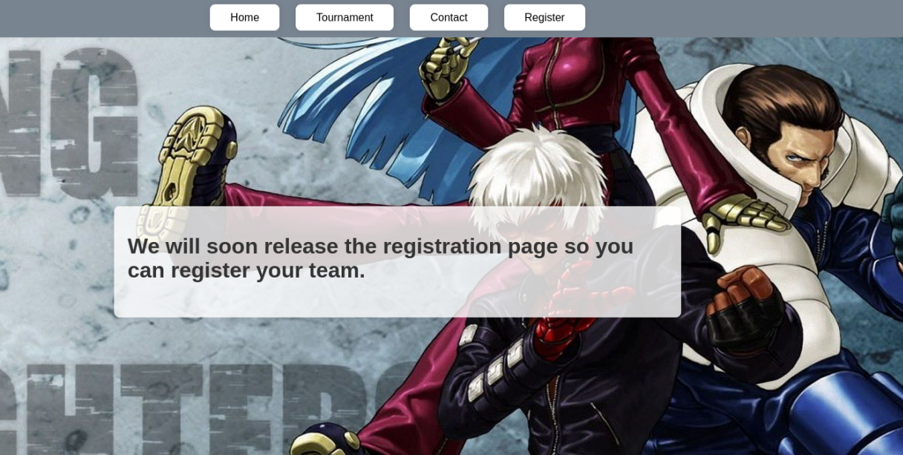
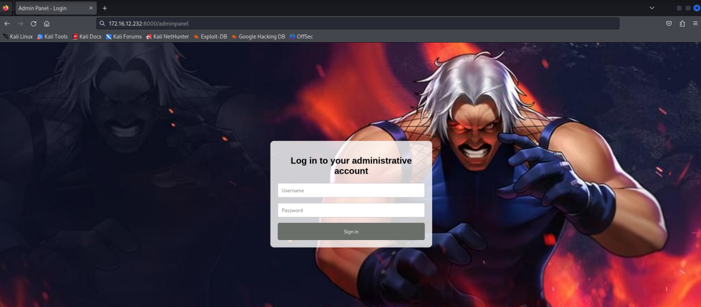

# KOF CTF (Hacking Club)
### Este write-up detalha como exploramos uma vulnerabilidade de SQL Injection combinada com um ataque de Command Injection para obter acesso ao sistema e escalar privilégios até o host principal.

## Iniciamos nossa análise realizando uma varredura de portas com o nmap para identificar serviços ativos no alvo:
```bash
sudo nmap -p- -Pn -sV --min-rate 400 -oN Allports 172.16.12.232
```
## Assim descobrimos que a porta 8000 está aberta.





## Ao acessar a porta 8000 , encontramos uma página relacionada a um campeonato de jogos onde era possível registrar equipes. No entanto, a funcionalidade de registro estava desativada. Durante a enumeração de diretórios utilizando FFuF, identificamos a rota /adminpanel, protegida por autenticação.


## Ao acessar a rota /adminpanel, identificamos que se trata de uma página de login. No entanto, sem as credenciais necessárias, não foi possível acessar o painel administrativo. Tentamos explorar possíveis vulnerabilidades de SQL Injection , mas sem sucesso.



## Retornando à página principal e analisando sua estrutura, encontramos um campo de pesquisa que permitia consultar os nomes das equipes cadastradas. Ao inserir uma payload simples de SQL Injection , como:
### ' or 1=1 --


## Para explorar essa vulnerabilidade, utilizamos o Burp Suite . Com a ferramenta aberta, interceptamos a requisição HTTP para análise. Ao pressionar Ctrl + R , enviamos a requisição para a aba "Repeater" . A partir desse ponto, realizamos diversos testes para explorar a vulnerabilidade de SQL Injection