# Write-up Saori (Hacking Club)

## A máquina Saori é classificada como fácil e foca em técnicas de análise de tráfego de rede e exploração de vulnerabilidades no Ghostscript (CVE-2024-29510). Neste write-up, vou detalhar passo a passo como concluí o desafio, explorando desde a enumeração inicial até a obtenção da flag final.

## Sendo assim, começamos fazendo uma varredura utilizando a ferramenta Nmap.

.png)

## Os resultados mostraram:
- Porta 80: Serviço web.
- Porta 22: Serviço SSH.

## Ao acessar a porta 80 , fui redirecionado para o domínio saori.hc . Para resolver isso, adicionei uma entrada no arquivo /etc/hosts:

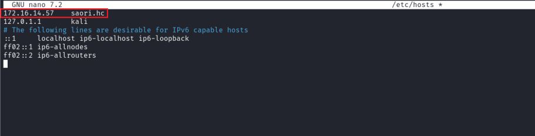

## Após essa configuração, conseguimos acessar o site e identificamos que se tratava de um blog. Na barra de navegação, havia um botão para baixar um cliente.

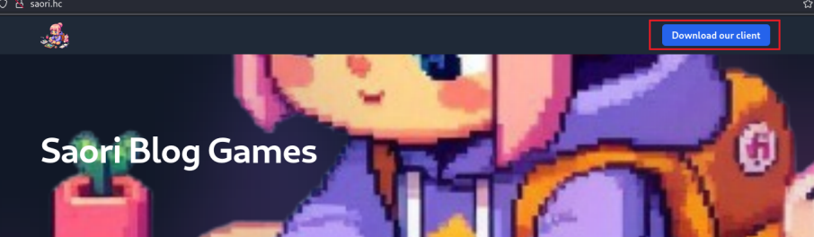

## Baixamos o cliente e verificamos que se tratava de um binário no formato ELF 64 . Ao executá-lo, observamos que ele tentava realizar uma requisição HTTP, mas a operação falhava.

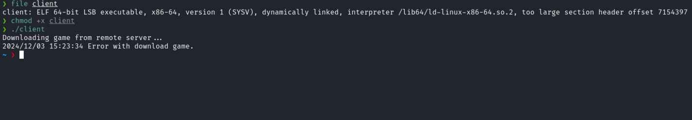

## Tendo em mente que o binário realiza uma requisição HTTP,  vamos utilizar o Wireshark para analisar o tráfego de rede gerado pela execução do binário

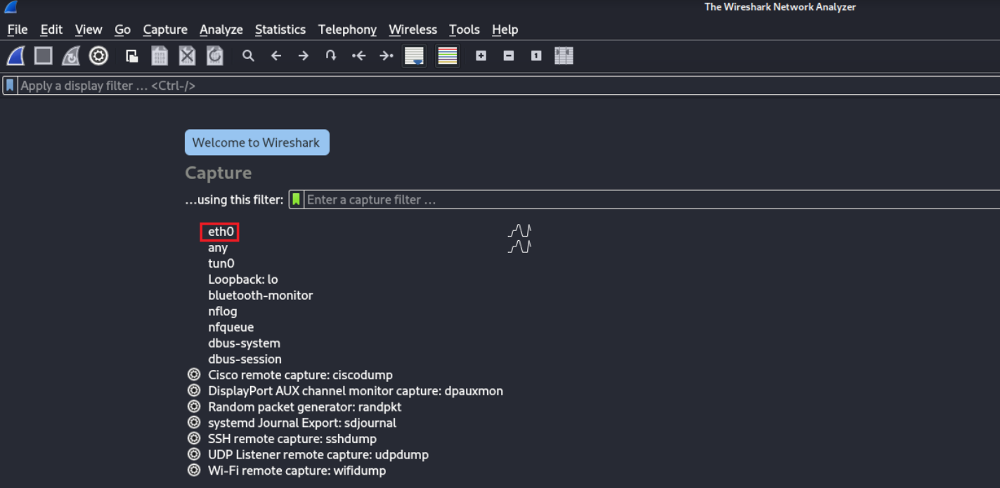
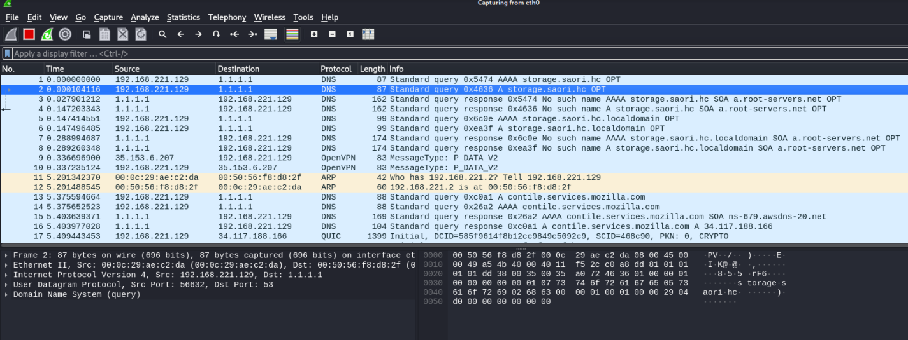

## No tráfego capturado, identificamos que o cliente tentava se conectar ao subdomínio storage.saori.hc . Adicionamos esse subdomínio ao arquivo /etc/hosts:

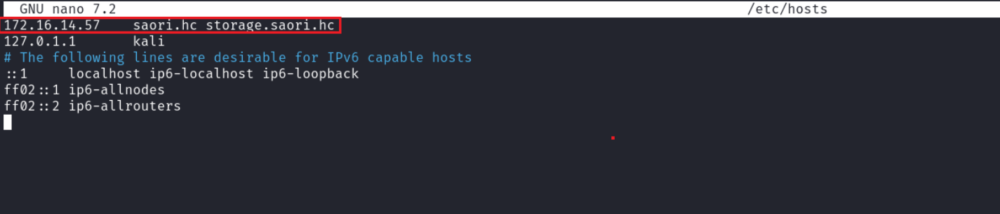

## Ao executar o cliente novamente, observamos uma requisição GET para o endpoint /game.sfc. No cabeçalho da requisição, descobrimos credenciais codificadas em Base64 usando autenticação básica (Basic Auth ).

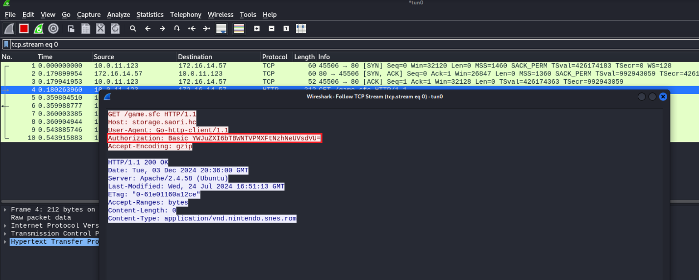

## Decodificamos o valor em Base64 e obtivemos as credenciais:

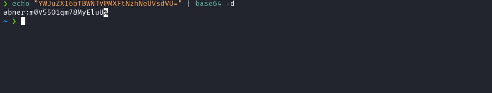

## Com essas credenciais, conseguimos acessar o servidor via SSH .

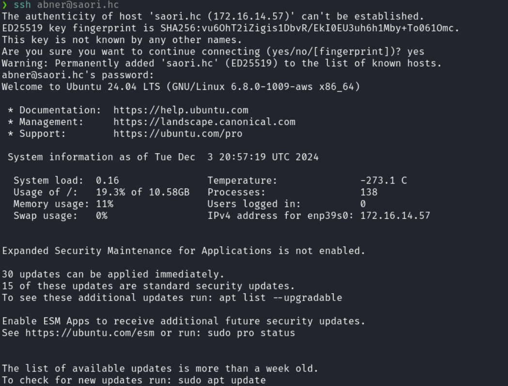

## Ao acessar o servidor via SSH, encontramos a primeira flag na pasta home do usuário abner.

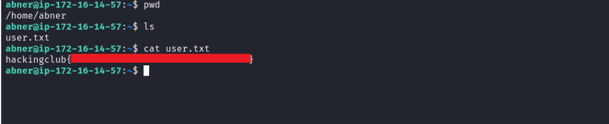

## Executamos o comando sudo -l e descobrimos que tínhamos permissão para executar o Ghostscript com privilégios de root sem fornecer senha. Além disso, notamos o uso do caractere curinga /root/*, indicando uma possível vulnerabilidade de path traversal. Além disso, ao executar gs --help , identificamos que a versão do Ghostscript instalada é a 10.03.0.

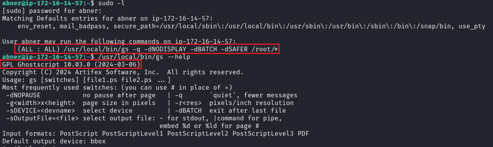

## Pesquisamos por vulnerabilidades na versão 10.03.0 do Ghostscript e encontramos a CVE-2024-29510, que descreve uma vulnerabilidade de format string exploitation. Para mais informações e detalhes técnicos sobre essa CVE, segue o link: [CVE-2024-29510](https://codeanlabs.com/blog/research/cve-2024-29510-ghostscript-format-string-exploitation/)

## No link fornecido, encontramos uma prova de conceito (PoC) que, por padrão, executa o gnome-calculator. Podemos modificar o código da PoC para executar o comando id e salvar a saída no arquivo id.txt . Isso permitirá validar se é possível executar comandos no contexto do exploit.

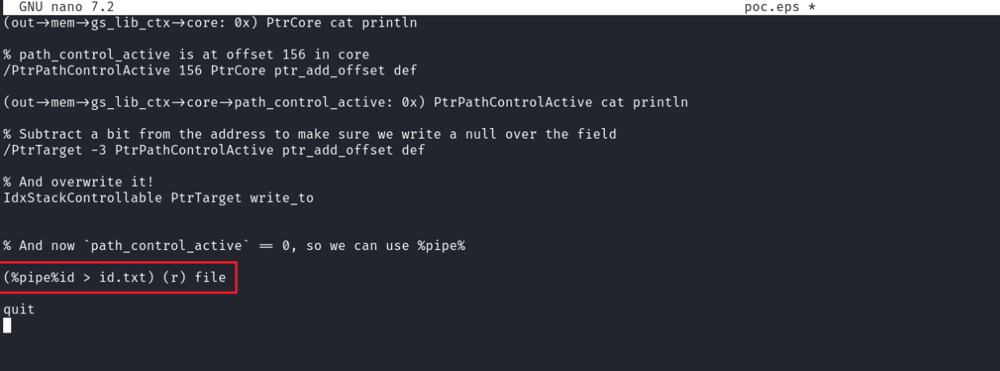
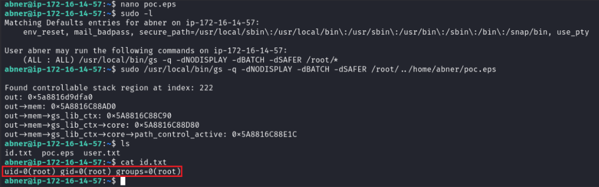

## Observamos que o exploit funcionou conforme o esperado, pois o arquivo id.txt foi criado e, ao lê-lo, encontramos a saída do comando id , confirmando a execução bem-sucedida. É importante destacar que, para executar o arquivo poc.eps localizado em nossa home, foi necessário explorar a vulnerabilidade de path traversal para manipular o caminho de execução.
## Com base nisso, modificamos o comando no exploit para chmod u+s /bin/bash , configurando o binário bash com a permissão SUID . Dessa forma, ao executarmos bash -p , obtivemos uma shell privilegiada, permitindo o acesso como root. Com essa shell, conseguimos capturar a última flag do desafio.

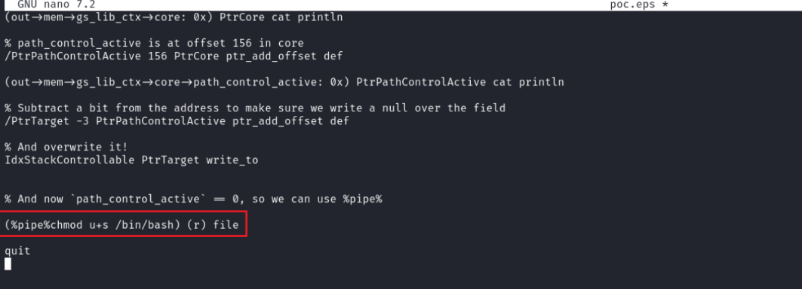
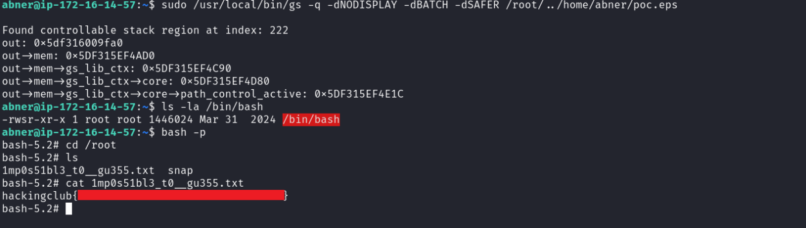

**Autor:** [malcriado](https://github.com/felipeluan20)  
**Plataforma:** CTF Write-ups  
**Missão:** Compreender, explorar e documentar.
